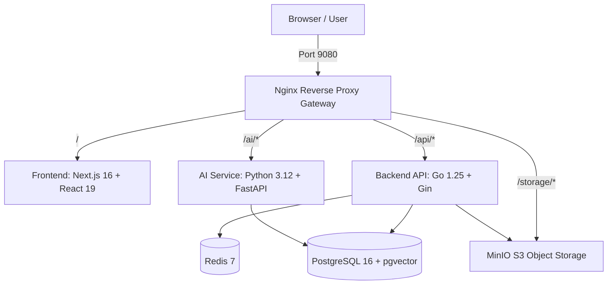

# Taskure

**Taskure** is a self-hosted, personal project workspace and focus management system built with a high-performance, modern web stack. It combines interactive Kanban board workflows, self-hosted S3 object storage, and a multi-service architecture designed for deep AI integration (RAG and LLM streaming).

> [!IMPORTANT]
> **Status: Early Development / Pre-Release**  
> Taskure is under active development. Core Kanban operations, project templating, S3 file storage, and advanced filtering are fully functional. AI capabilities, RAG pipelines, and multi-user authentication are currently in scaffolding/WIP stages.

---

## Overview

Taskure provides a distraction-free, privacy-first platform to manage projects, tasks, and assets locally. It is designed to run completely on your own infrastructure via Docker, requiring no external cloud dependencies for core functionality.

### Key Highlights
- **Privacy-First & Self-Hosted**: Full control over your data, database, and asset storage.
- **Modern Interactive UI**: Fast drag-and-drop workflows, customizable themes, and compact control interfaces.
- **Integrated S3 Storage**: Self-hosted file attachments powered by MinIO.
- **AI-Ready Foundation**: Built-in `pgvector` database extension and FastAPI service for upcoming RAG and assistant features.

---

## Screenshots

<!-- Add screenshots or screen recordings of the Kanban board, Task drawer, and Theme engine here -->
> *Screenshots coming soon .*

---

## Current Implementation Status

| Feature / Component | Status | Description |
| :--- | :---: | :--- |
| **Kanban Board & Column Management** | `Production Ready` | Drag-and-drop tasks & columns, column duplication, deletion with task migration, inline task creation. |
| **Task Drawer & Checklists** | `Production Ready` | Priorities, workspace tags, due dates, subtask progress tracking, auto-resizing textareas. |
| **MinIO Attachment Storage** | `Production Ready` | File upload/deletion to local S3 bucket, proxied via Nginx (`/storage/*`). |
| **Advanced Filtering & Sorting** | `Production Ready` | Multi-facet filtering (tags, priority, due date, subtasks, attachments) and sorting with compact icon-only triggers. |
| **Project Templates & Workspace I/O** | `Production Ready` | Starter templates (Blank, Software Dev, Content Pipeline, Personal Goals) and JSON export/import. |
| **Design & Theme System** | `Production Ready` | Dark (OLED), Dim (Graphite), and Light (Paper) themes with 5 accent color options and muted border aesthetics. |
| **Focus Engine Scoring** | `WIP / Scaffolding` | Backend ViewModel priority scoring algorithm built; UI interface in development. |
| **AI Assistant & Chat Streaming** | `WIP / Scaffolding` | FastAPI backend (`/ai/*`) and SSE streaming configured; UI chat panel not yet connected. |
| **Knowledge Base RAG** | `WIP / Scaffolding` | `pgvector` enabled in PostgreSQL and `ProjectContext` schema ready; ingestion pipeline pending UI connection. |
| **User Auth & Multi-Tenancy** | `WIP / Scaffolding` | JWT middleware exists in API; currently runs in Single-Tenant / Local Mode. |

---

## Features

### Production-Ready Features

- **Interactive Kanban Board**: Smooth drag-and-drop reordering of columns and tasks using `@dnd-kit`. Customize column colors, set WIP limits, duplicate columns, or delete columns with automatic task reassignment.
- **Task Management**: Comprehensive task drawer featuring 4 priority levels (Urgent, High, Medium, Low), workspace-wide tag library with dynamic badges, due date scheduling, subtask checklists with progress indicators, and rich description fields.
- **Self-Hosted Asset Storage**: Upload and manage task attachments directly using an integrated MinIO S3 object storage instance. Files are safely served through an Nginx reverse proxy routing `/storage/`.
- **Compact Filtering & Sorting**: Clean, unintrusive toolbar interface with icon-only triggers that dynamically expand when filters or custom sorts are active. Filter by tags, priority, due dates, subtask status, or attachment presence.
- **Templates & Portability**: Launch projects quickly with pre-configured templates or backup and restore your entire workspace via structured JSON import/export.
- **Customizable Aesthetics**: Switch between Dark (OLED), Dim (Graphite), and Light (Paper) visual modes paired with 5 curated accent colors.

### Work-in-Progress (WIP) Features

- **AI Chat Assistant**: Streaming SSE responses via FastAPI service with OpenAI and Anthropic SDK support.
- **Project Knowledge Base (RAG)**: Document vectorization and context retrieval powered by PostgreSQL `pgvector`.
- **Focus Engine**: Automated task prioritization scoring based on urgency, weights, and due dates.

---

## Architecture Overview

Taskure employs a flat *microservices-lite* structure orchestrated via Docker Compose. All client traffic passes through an Nginx reverse proxy acting as an API gateway.



> For deep architectural specifications, data model definitions, and Nginx proxy configs, refer to internal documentation in [`docs-internal/`](file:///home/pixy/Projects/kanban/docs-internal/).

---

## Quick Start Guide

### Prerequisites
- [Docker](https://docs.docker.com/get-docker/) and [Docker Compose](https://docs.docker.com/compose/install/) installed.

### Running with Docker Compose

1. Clone the repository:
   ```bash
   git clone https://github.com/Ijon6k/Taskure.git
   cd Taskure
   ```

2. (Optional) Configure environment variables:
   ```bash
   cp .env.example .env
   # Edit .env to add OPENAI_API_KEY or ANTHROPIC_API_KEY for future AI features
   ```

3. Launch all services:
   ```bash
   docker compose up -d
   ```

4. Access the application at **[http://localhost:9080](http://localhost:9080)**.

---

## Services Overview

All services run inside a unified Docker bridge network (`kanban-network`).

| Service | Internal Container Port | Gateway Route / Exposed Port | Description |
| :--- | :---: | :---: | :--- |
| **Nginx** | `80` | `http://localhost:9080` | API Gateway, load balancer, static file proxy |
| **Web** | `3000` | `/` | Next.js 16 Frontend application |
| **API** | `4000` | `/api/*` | Go 1.25 Gin REST API & GORM ORM |
| **AI** | `5000` | `/ai/*` | Python FastAPI service for AI & SSE streaming |
| **PostgreSQL** | `5432` | Internal | PostgreSQL 16 database with `pgvector` |
| **MinIO** | `9000` / `9001` | `/storage/*` | S3-compatible object storage for file attachments |
| **Redis** | `6379` | Internal | Redis 7 caching and message broker |

---

## Local Development Setup

If you wish to modify the code locally without running full Docker containers for frontend and backend:

### 1. Start Infrastructure Dependencies
```bash
docker compose up -d postgres minio redis
```

### 2. Run Backend (Go)
*Requires Go 1.25+*
```bash
cd backend
go run ./cmd/server
```

### 3. Run Frontend (Next.js)
*Requires Bun or Node.js 20+*
```bash
cd frontend
bun install
bun dev
```

---

## Project Roadmap

- [x] Core Kanban board with drag-and-drop column & task ordering
- [x] MinIO S3 object storage integration for task attachments
- [x] Project templates (Software Dev, Content Pipeline, Personal Goals)
- [x] Compact filtering & sorting UI system
- [x] Workspace JSON export and import
- [ ] Connect AI Assistant SSE streaming chat to Frontend UI
- [ ] Implement document chunking & ingestion pipeline for `pgvector` RAG
- [ ] Connect Focus Engine prioritization UI view
- [ ] Complete multi-user authentication & workspace permission management

---

## Technology Stack

- **Frontend**: Next.js 16 (App Router), React 19, TypeScript, Tailwind CSS v4, `@dnd-kit`, Zustand v5, React Query v5, Lucide Icons, Radix UI.
- **Backend API**: Go 1.25, Gin Framework, GORM, MinIO Go SDK, Zerolog, JWT.
- **AI Service**: Python 3.12, FastAPI, Uvicorn, OpenAI SDK, Anthropic SDK.
- **Database & Storage**: PostgreSQL 16 (`pgvector`), MinIO S3, Redis 7.
- **DevOps & Proxy**: Nginx 1.26 Alpine, Docker Compose.

---

## Technical Documentation

Detailed internal documentation regarding the codebase structure, function maps, database schemas, and migration reports can be found in the [`docs-internal/`](file:///home/pixy/Projects/kanban/docs-internal/) directory:
- [System Architecture & Features Report](file:///home/pixy/Projects/kanban/docs-internal/reports/SYSTEM_ARCHITECTURE_AND_FEATURES_REPORT.md)
- [Internal Document Index](file:///home/pixy/Projects/kanban/docs-internal/README.md)

---

## Contributing

Contributions, issues, and feature requests are welcome! Feel free to check the [issues page](https://github.com/Ijon6k/Taskure/issues) if you want to contribute.

---

## License

This project is licensed under the [MIT License](LICENSE).
