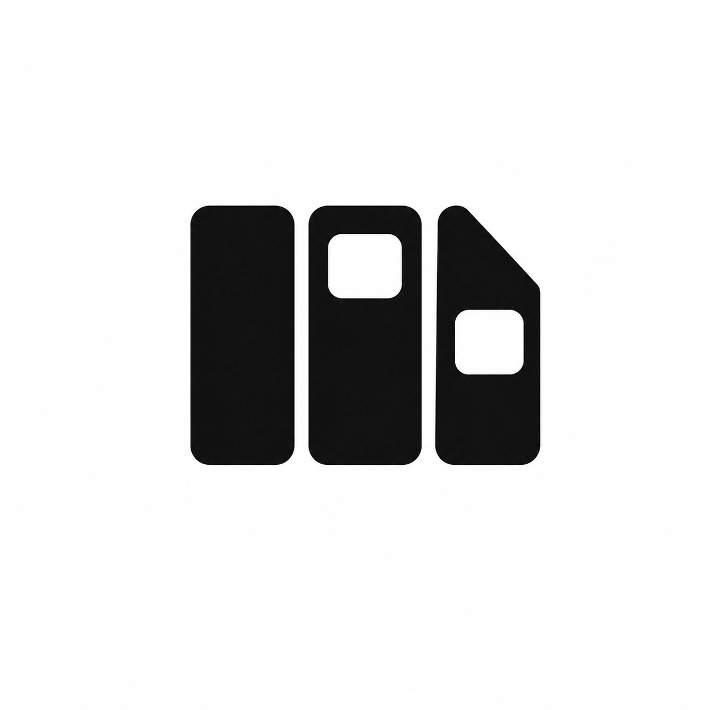

<div align="center">
  
</div>

<div align="center">
  <a href="https://go.dev"></a>
  <a href="https://www.typescriptlang.org"></a>
  <a href="https://nextjs.org"></a>
  <a href="https://www.docker.com"></a>
  <a href="LICENSE"></a>
  <a href="#"></a>
</div>

<div align="center">
  <b>Taskure</b> — self-hosted personal workspace for Kanban, notes, and assets.
</div>

---

## Quick Start

```bash
git clone https://github.com/Ijon6k/Taskure.git
cd Taskure
docker compose up -d
# → http://localhost:1106
```

---

## Screenshots

| | | |
|:---:|:---:|:---:|
|  |  |  |
| *Kanban board* | *Notebook editor* | *Task drawer* |
|  |  | |
| *Project dashboard* | *Settings & themes* | |

> Drop your screenshots in `assets/preview/`, refresh, done.

---

## Features

| Feature |
| :--- |
| Kanban board — drag & drop columns, tasks, inline editing |
| Task drawer — priority, tags, due date, checklist items |
| Notebook — TipTap markdown editor, tables, `/` slash menu |
| File attachments — self-hosted MinIO S3 |
| Filters & sorting — multi-facet, compact toolbar |
| Project templates + JSON export/import |
| Themes — dark (OLED), dim (graphite), light (paper) · 5 accent colors |
| AI chat · RAG pipeline (pgvector) — *work in progress* |

---

## Services & Architecture

**Service ports**

| Service | Stack | Port |
|:---|:---|---:|
| Nginx | API gateway + reverse proxy | `1106` |
| Web | Next.js · React 19 · Tailwind · TipTap | `3000` |
| API | Go · Gin · GORM | `4000` |
| AI | Python · FastAPI · pgvector | `5000` |
| PostgreSQL | pgvector extension | `5432` |
| MinIO | S3-compatible storage | `9000` |

**Request flow**

```text
Browser → Nginx (:1106)
           ├── /          → Next.js (:3000)
           ├── /api/*     → Go + Gin (:4000) ──→ PostgreSQL + pgvector
           ├── /ai/*      → FastAPI (:5000)  ──→ PostgreSQL + pgvector
           └── /storage/* → MinIO S3 (:9000)
```

---

## Local Dev

```bash
docker compose up -d postgres minio
cd backend && go run ./cmd/server
cd frontend && bun install && bun dev
```

---

## License

MIT · [Ijon6k](https://github.com/Ijon6k)
