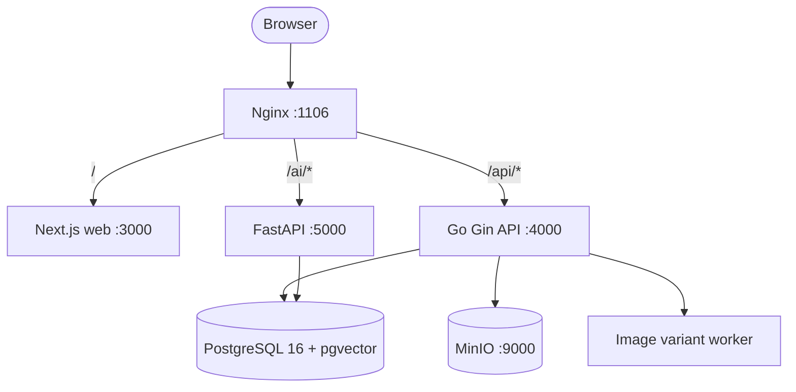

# Taskure Architecture

## 1. Overview

Taskure is a self-hosted, single-user project workspace: a Kanban board with a "Today's Focus" engine, S3-based asset storage, and (WIP) AI RAG integration. The system is a flat multi-service monorepo with a Go API, a Next.js web app, a FastAPI AI service, and Postgres/MinIO backing stores — all behind a single nginx gateway.

## 2. Service Layout

```
kanban/
├── frontend/         # Next.js 16 (App Router), React 19, Tailwind v4, @dnd-kit, Zustand
├── backend/          # Go 1.25, Gin, GORM — the core API
├── ai/               # Python FastAPI + pgvector (WIP: RAG/LLM streaming)
├── nginx/            # Reverse proxy (entry point, port 1106)
├── compose.yaml      # Production stack: nginx, web, api, ai, postgres, minio
├── compose.dev.yaml  # Dev overrides (hot reload, profiles)
├── scripts/dev.ts    # Interactive dev environment launcher
└── docs/             # Public documentation (this directory)
```



## 3. Backend (Go API)

### 3.1 Clean Architecture Layering

Dependency rule: handlers depend on services, services depend on repositories. Every layer talks through interfaces defined in the service layer.

```
handler (HTTP/JSON, validation, response helpers)
   │  service interfaces
service (business rules, orchestration, transactions)
   │  repository interfaces
repository (GORM queries, scoped reads)
   │
models / db (GORM models, AutoMigrate)
```

- **handlers** (`internal/handler/`) — thin: bind/validate input, call one service method, emit a standard response envelope (`internal/response/`).
- **services** (`internal/service/`) — business rules and cross-entity orchestration:
  - `TaskService` — tasks, checklist items, attachments, focus queries, suggested tags.
  - `ProjectService` — CRUD, board/overview/assets payloads, resource uploads, tag stats.
  - `ColumnService`, `WorkspaceService`, `ImportService` (atomic board replace), `SeedService`.
- **repositories** (`internal/repository/`) — GORM queries, always scoped (by workspace/project), with composite indexes kept aligned to real query shapes.
- **viewmodels** (`internal/viewmodels/`) — hand-built JSON shapes per page (summary, board, overview, assets, focus). Payloads are deliberately split by consumption: the board is heavy, overview/summary are light.
- **focusengine** (`internal/focusengine/`) — pure scoring logic for "Today's Focus" (deadline windows, priority, blocking subtasks, recency).
- **worker** (`internal/worker/`) — background image-variant (WebP) generation loop; uploads only persist the original and enqueue a job, so the request path stays fast.
- **storage** (`internal/storage/`) — MinIO adapter (S3 API); falls back to local disk when MinIO is unavailable.
- **config / db / util / middleware / response / nanoid / imageutil** — shared plumbing.

### 3.2 Key Cross-Cutting Decisions

- **Dual IDs**: internal UUID PKs + public NanoIDs (`ws_`, `prj_`, `tsk_`, `cap_`, `ctx_`). API routes accept either; JSON serializes the public ID as `id` for top-level entities.
- **Async image variants**: uploads store the original; the background worker builds derived WebP widths. `VARIANT_WORKERS` controls concurrency (each worker holds a decoded bitmap — keep small relative to container memory).
- **`resourcesMu` serialization**: `settings.resources` is read-modify-write across `UpdateProject` (link edits), `UploadResource` and `DeleteResource`; a mutex serializes all three.
- **Error envelope**: `{ "error": "..." }`; in debug mode 500s leak the real message, in production they are generic.

## 4. Frontend (Next.js)

### 4.1 Data Layer — "Patch, don't refetch"

React Query is the source of truth for boards. The pattern:

1. Queries are keyed by scope: `PROJECT_KEYS.detail(id)`, `.board(id)`, `.overview(id)`, `.assets(id)`, workspace/focus keys.
2. Mutations (`useCreateTask`, `useUpdateTask`, `useMoveTask`, checklist mutations, drawer mutations) apply an **optimistic** update to the board cache immediately, with rollback on error.
3. On success the cache is **patched** from the server response (`task-cache.ts`) instead of refetching the whole board — moves are column-aware (removed from every column, inserted at the target position, sorted).
4. Light payloads (overview, focus, detail) are **invalidated** (`invalidateProjectOverview` / `invalidateFocusQueries`) since they cannot be derived from a single mutation response.

This keeps the heavy `/board` endpoint out of every mutation round-trip.

### 4.2 UI Structure

- `app/(dashboard)/` — projects list, board, overview, resources, focus pages.
- `components/features/` — feature-owned components + hooks: `kanban/` (board, DnD via `@dnd-kit`), `task/` (drawer), `project/` (resources, overview).
- `lib/api/` — typed service layer (`services/`), React Query hooks (`queries/`), the board cache (`task-cache.ts`), helpers (`helpers/`), and `client.ts` (axios instance).
- `lib/store/` — Zustand stores (UI state, theme).
- Theming: Tailwind v4 CSS-variable tokens (`@theme inline`) — dark/light via a ThemeProvider.

### 4.3 Drag & Drop

`useKanbanDnd` owns sensors/handlers and an optimistic reorder; after a successful `PATCH /tasks/:id/move` it emits `onTaskMoved` so the page can patch the board cache and invalidate derived queries — the board is never refetched on a move.

## 5. Storage & Data

- **PostgreSQL 16 + pgvector** (`kanban-postgres`) — canonical store; GORM AutoMigrate on boot (`models.AllModels()`).
- **MinIO** (`kanban-minio`, :9000 API / :9001 console) — original uploads + generated WebP variants; served publicly through the API at `/storage/*`.
- **No Redis** — the in-memory rate limiter and React Query cache cover current needs; Redis was removed from the stack.

## 6. Gateway (nginx)

Single entry point on `:1106`:
- `/` → web (`web:3000`)
- `/api/` → Go API (`api:4000`)
- `/ai/` → FastAPI (`ai:5000`)

## 7. Focus Engine (flow)

1. `GET /api/focus` loads all focus-enabled projects and their tasks.
2. `focusengine` scores candidates: deadline windows (overdue → due today → near), priority (urgent/high), blocking uncompleted subtasks, recency (< 48 h).
3. The hero + top recommendations are mapped to the focus viewmodel; reason tags are derived in the **client's timezone** so the label always matches the date the user sees.

## 8. What's WIP / Scaffolded

- Multi-user auth (JWT scaffolding only — routes are unguarded).
- AI service (`ai/`) — RAG pipeline and LLM streaming are in scaffolding stage.
- Discussions, notes, captures, activities — models exist; endpoints/UI are not shipped.

## 9. Related Docs

- [API Reference](./API.md)
- [Database Schema](./DATABASE.md)
- [Development Setup](./DEVELOPMENT.md)
